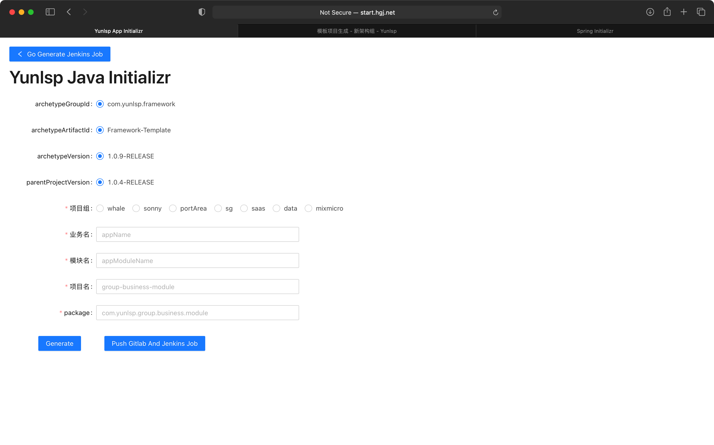

== 快速开始

Mixmicro+ Components Framework可以与 "经典 "Java开发工具一起使用，也可以作为命令行工具安装。无论哪种方式，你都需要Java SDK v1.8或更高版本。在你开始之前，你应该使用以下命令检查你当前的Java安装情况。

[source,bash]
----
$ java -version
----

如果你是Java开发的新手，或者你想尝试使用Mixmicro+ Components Framework，你可能想先试试 _Mixmicro+ Components Framework CLI_（命令行界面）。否则，请继续阅读 "经典 "安装说明。

=== Maven 手动创建

Mixmicro+ Components Framework与Apache Maven 3.3或以上版本兼容。如果你还没有安装Maven，你可以按照 https://maven.apache.org[maven.apache.org]的说明进行安装。

> 在许多操作系统上，Maven可以通过包管理器安装。如果你使用OSX Homebrew，可以尝试使用 brew install maven。Ubuntu用户可以运行sudo apt-get install maven。使用Chocolatey的Windows用户可以在高阶（管理员）提示下运行choco install maven。

下面列出了一个典型的 _pom.xml_文件。

[source,xml]
----
<?xml version="1.0" encoding="UTF-8"?>
<project xmlns="http://maven.apache.org/POM/4.0.0" xmlns:xsi="http://www.w3.org/2001/XMLSchema-instance"
    xsi:schemaLocation="http://maven.apache.org/POM/4.0.0 https://maven.apache.org/xsd/maven-4.0.0.xsd">
    <modelVersion>4.0.0</modelVersion>

    <groupId>com.example</groupId>
    <artifactId>myproject</artifactId>
    <version>0.0.1-SNAPSHOT</version>

    <dependencies>
        <dependency>
            <groupId>com.yunlsp.framework.components</groupId>
            <artifactId>mixmicro-components-starter-spring-web</artifactId>
        </dependency>
    </dependencies>

    <!-- Add typical dependencies management for application -->
    <dependencyManagement>
       <dependencies>
            <dependency>
                <groupId>com.yunlsp.framework.components</groupId>
                <artifactId>mixmicro-components-dependencies</artifactId>
                <version>1.0.7.RELEASE</version>
                <scope>import</scope>
                <type>pom</type>
            </dependency>
        </dependencies>
    </dependencyManagement>

    <!-- Package as an executable jar -->
    <build>
        <plugins>
            <plugin>
                <groupId>org.springframework.boot</groupId>
                <artifactId>spring-boot-maven-plugin</artifactId>
            </plugin>
        </plugins>
    </build>
</project>
----

=== 命令行安装

_Mixmicro+ Components Framework CLI_ 使用maven archetype插件来生成项目结构。

[source,bash]
----
mvn archetype:generate \
  -DarchetypeCatalog=internal \
  -DarchetypeGroupId=com.yunlsp.framework \
  -DarchetypeArtifactId=Framework-Template \
  -DarchetypeVersion=1.0.9-RELEASE \
  -DGROUP_NAME=whale \
  -DBUSINESS_NAME=user \
  -DMODULE_NAME=account \
  -DartifactId=whale-user-account \
  -Dpackage=com.yunlsp.whale.user.account \
  -DPARENT_PROJECT_VERSION=1.0.4-RELEASE
----

> 概念解释

|===
|配置属性 | 描述 | 可选 | 默认值

|archetypeGroupId
|使用 framework-template 的 groupId (不用更改)
|True
|com.yunlsp.framework

|archetypeArtifactId
|使用 framework-template 的 artifactId (不用更改)
|True
|Framework-Template

|archetypeVersion
|使用 framework-template 的版本号 (不用更改)
|True
|1.0.9-RELEASE

|PARENT_PROJECT_VERSION
|生成的父项目版本号 (不用更改)
|True
|-

|GROUP_NAME
|创建项目的组名;每个组只有一个且唯一 (不可乱改,一个组一个; 强烈建议与 AppName 中组名一致)
|False
|-

|BUSINESS_NAME
|项目的业务名 (自定义, 强烈建议与 AppName 中业务名一致)
|False
|-

|MODULE_NAM
|项目的模块名 (自定义, 强烈建议与 AppName 中模块一致)
|False
|-

|artifactId
|创建出来的项目目录名 (目录名, 强烈建议是 组名-业务名-模块名 拼接在一起的名称)
|False
|-

|package
|生成的统一报名 (强烈建议,统一包名前缀com.yunlsp.GROUP_NAME.BUSINESS_NAME.MODULE_NAME)
|False
|-
|===

=== 引导页创建

Mixmicro Initializr支持运行在 http://start.hgj.net 的自定义用户界面创建项目。

