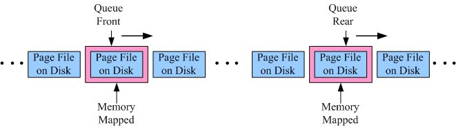

# Mixmicro+ Queue Kit

A big, fast and persistent queue based on memory mapped file.

***Notice***, queue is just a standalone library, for a high-throughput, persistent, distributed, publish-subscrible messaging system . 

## Feature Highlight:  
1. **Fast**: close to the speed of direct memory access, both enqueue and dequeue are close to O(1) memory access.  
2. **Big**: the total size of the queue is only limited by the available disk space.  
3. **Persistent**: all data in the queue is persisted on disk, and is crash resistant.
4. **Reliable**: OS will be responsible to presist the produced messages even your process crashes.  
5. **Realtime**: messages produced by producer threads will be immediately visible to consumer threads.
6. **Memory-efficient**: automatic paging & swapping algorithm, only most-recently accessed data is kept in memory.  
7. **Thread-safe**: multiple threads can concurrently enqueue and dequeue without data corruption.  
8. **Simple&Light-weight**: current number of source files is 12 and the library jar is less than 30K.


## The Big Picture

### Memory Mapped Sliding Window



## How to Use

### Direct jar or source reference  
Download jar from repository mentioned in version history section below, latest stable release is [1.0.0.RC2](#maven-reference).   
***Note*** : queue depends on log4j, please also added log4j jar reference if you use queue.

### Maven reference  

```xml

<dependency>
  <groupId>com.yunlsp.framework.components</groupId>
  <artifactId>queue-kit</artifactId>
  <version>1.0.0.RC2</version>
</dependency>

```
